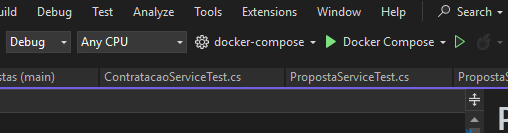
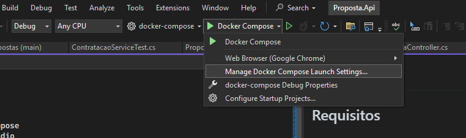
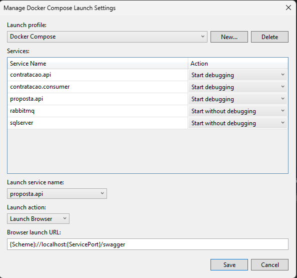
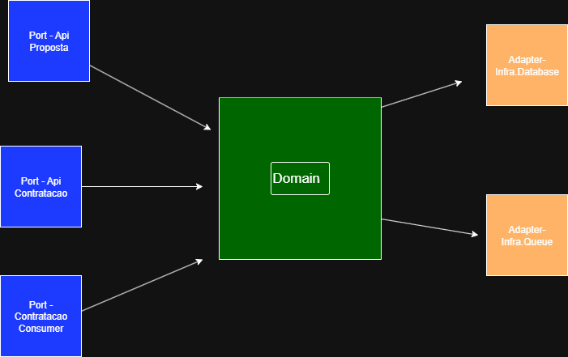

# Propostas

## Requisitos

- [x] Docker
- [x] Docker Compose
- [x] Visual Studio
 
## Debug
1. Clone o repositório
2. No diretório Infra.Database execute o comando 
	 ```bash
	   dotnet ef database update --connection "Server=localhost;Database=proposta;User Id=sa;Password=SqlServer2022!; TrustServerCertificate=True"
	```
3. Inicie o debug 

4. Para alterar quais os projetos serão iniciados no debug, 
	1. clique em "Manage Docker compose Launch Setting" 
	2. Selecione os projetos que deseja iniciar e qual deverá ser aberto automaticamente pelo navegador(Você pode acessar os outros swagger normalmente pelo navegador) 

	
 
## Arquitetura

